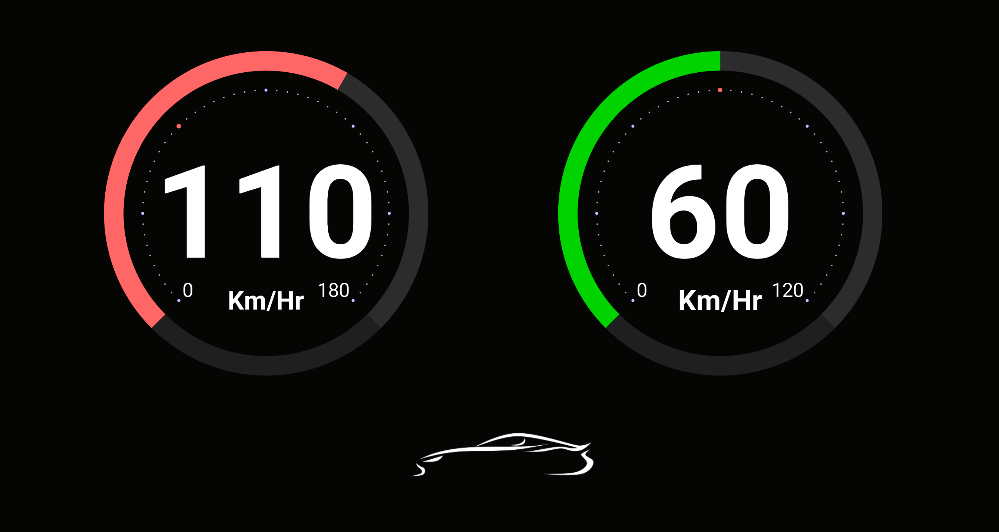

# Speedo Limit
## About
This android app accurately computes vehicle's speed using GPS and compares it with the road's speed limit extracted from Google Roads API to warn the driver on limit breach. 

## Working
The application combines GPS technology of the phone with internet and computes the exact velocity of the device/vehicle. It is arguably more accurate than the vehicle's speedometer as well.
The application also finds the Speed Limit of the place by using Google's Roads API.
As soon as the current speed crosses the speed limit the device warns the driver in the form of a beeping sound.

## Screenshots

 

